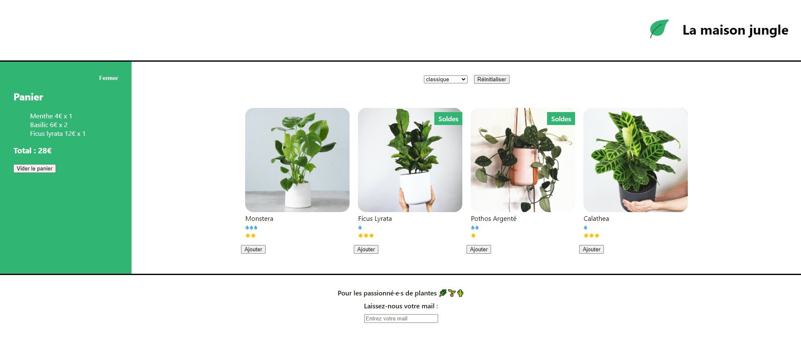

# OpenClassrooms React course 

This is my first React app. This site is named "la-maison-jungle".

----

----

To run app, launch command: "npm start". 
App will be launch on http://localhost:3000 .
